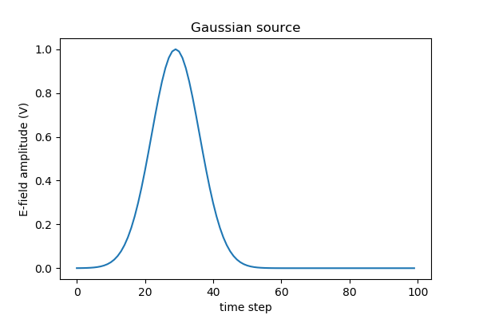
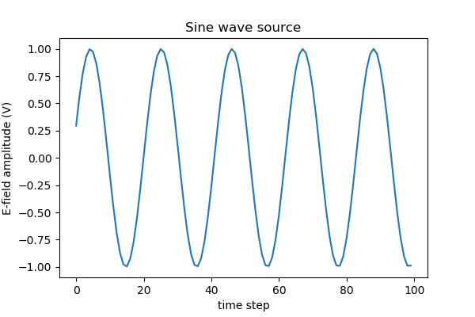
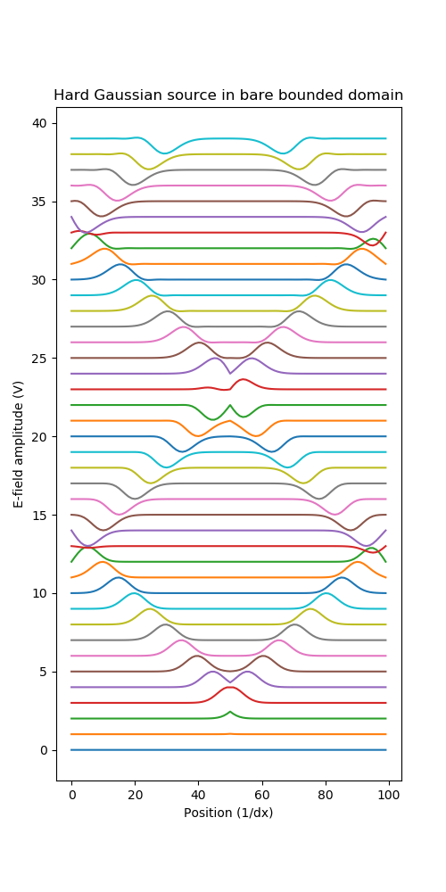
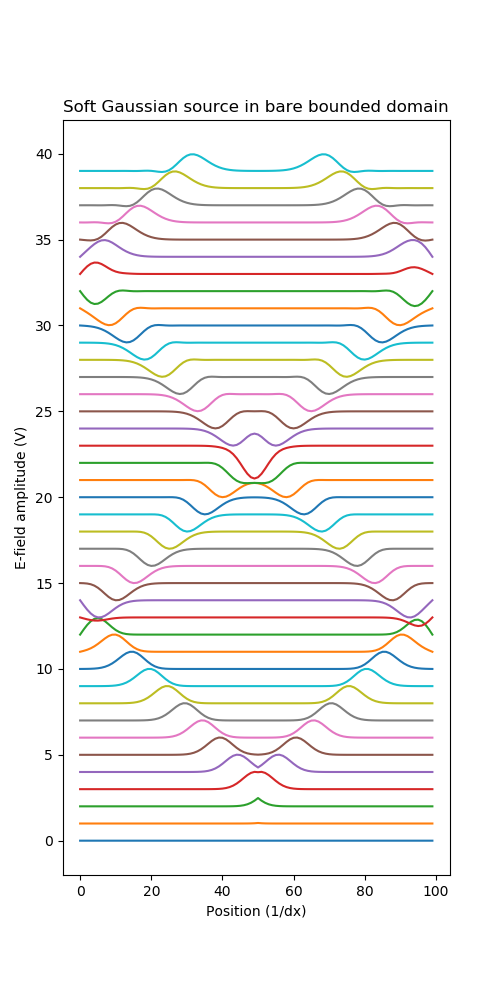
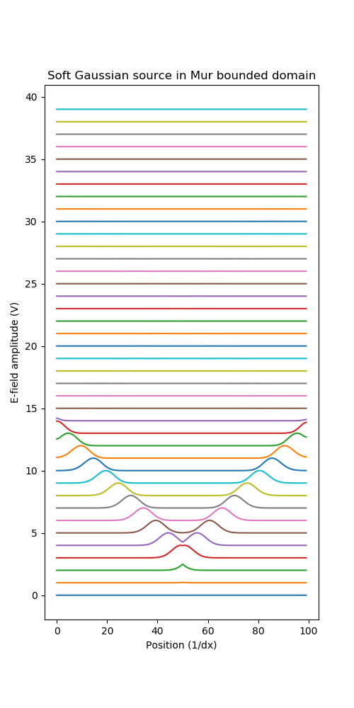

# pyfdtd1
1D finite difference time domain simulation in python code - for education purposes, not performance!

Status - Mur and bare domains with default Gaussian source have been 'eyeballed' for correctness.

## Getting started

clone the repo and run core.py to see the demonstration results.

## Demo code:

### Gaussian Source
```
demo = FDTD1(0.1,50,25, source_wave = Wave.GAUSSIAN, source_type = Source.HARD, boundary_type = Boundary.MUR) 
source = []
for n in range(100):
    demo.time_step = demo.time_step + 1
    demo.update_source()
    source.append(demo.source_value)
plt.figure()    
plt.plot(source)    
plt.xlabel('time step')     
plt.ylabel('E-field amplitude (V)')
plt.title('Gaussian source')
plt.savefig('../img/gaussian_source.png', dpi=100)
```


### Sine wave source

    demo = FDTD1(0.1,50,25, source_wave = Wave.SINE, source_type = Source.HARD, boundary_type = Boundary.MUR) 
    source = []
    for n in range(100):
        demo.time_step = demo.time_step + 1
        demo.update_source()
        source.append(demo.source_value)
    plt.figure()    
    plt.plot(source)    
    plt.xlabel('time step')     
    plt.ylabel('E-field amplitude (V)')
    plt.title('Sine wave source')
    plt.savefig('../img/sine_source.png', dpi=100)
	
	
	

### Hard Gaussian source in bare domain

```
demo = FDTD1(0.1,100,50, source_wave = Wave.GAUSSIAN, source_type = Source.HARD, boundary_type = Boundary.BARE)
source = []
plt.figure()
offset = 0
for n in range(400):
    demo.iterate()
    if n%10==0:
        plt.plot(demo.Ez + offset)
        offset = offset + 1

plt.xlabel('Position (1/dx)')     
plt.ylabel('E-field amplitude (V)')
plt.title('Hard Gaussian source in bare bounded domain')
fig = plt.gcf()
fig.set_size_inches(5, 10)
fig.savefig('bare_gaussian_hard.png', dpi=100)  
```


### Soft Gaussian source in bare bounded domain

    demo = FDTD1(0.1,100,50, source_wave = Wave.GAUSSIAN, source_type = Source.SOFT, boundary_type = Boundary.BARE) 
    source = []
    plt.figure()
    offset = 0
    for n in range(400):
        demo.iterate()
        if n%10==0:
            plt.plot(demo.Ez + offset)
            offset = offset + 1
   
    plt.xlabel('Position (1/dx)')     
    plt.ylabel('E-field amplitude (V)')
    plt.title('Soft Gaussian source in bare bounded domain')
    fig = plt.gcf()
    fig.set_size_inches(5, 10)
    fig.savefig('../img/bare_gaussian_soft.png', dpi=100)
	


### Soft Gaussian source in Mur-bounded domain

A key requirement for the Mur Absorbing Boundary Condition implementation is that the Courant factor is set to the default value of 0.5, so that it takes exactly two time steps for a wave to pass from the penultimate electric field cell to the outermost electric field cell. 

    demo = FDTD1(0.1,100,50, source_wave = Wave.GAUSSIAN, source_type = Source.SOFT, boundary_type = Boundary.MUR) 
    source = []
    plt.figure()
    offset = 0
    for n in range(400):
        demo.iterate()
        if n%10==0:
            plt.plot(demo.Ez + offset)
            offset = offset + 1
   
    plt.xlabel('Position (1/dx)')     
    plt.ylabel('E-field amplitude (V)')
    plt.title('Soft Gaussian source in Mur bounded domain')   
    fig = plt.gcf()
    fig.set_size_inches(5, 10)
    fig.savefig('../img/mur_gaussian_soft.png', dpi=100)
	

